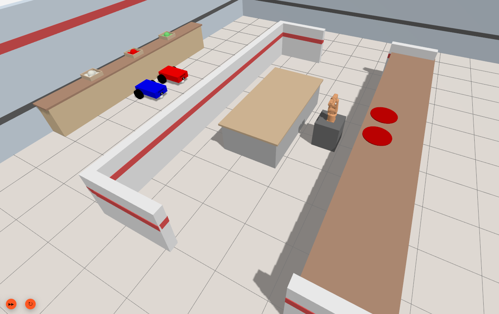
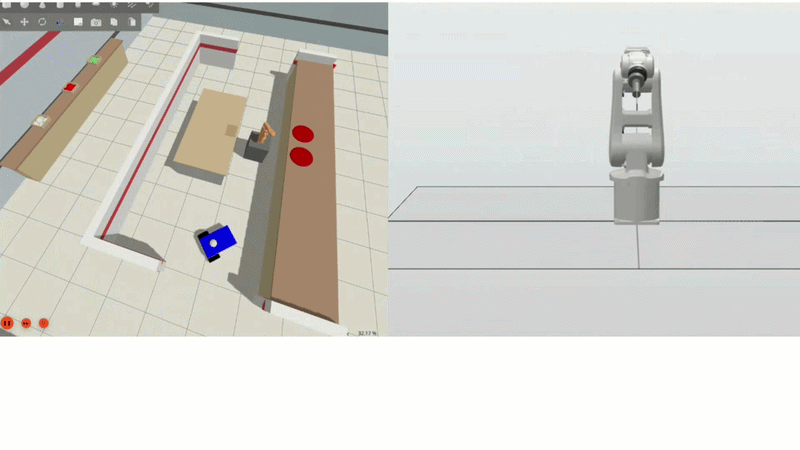
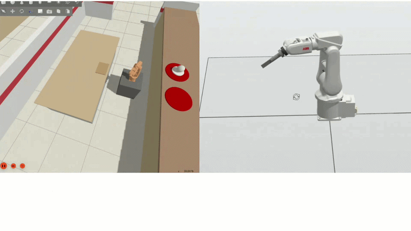
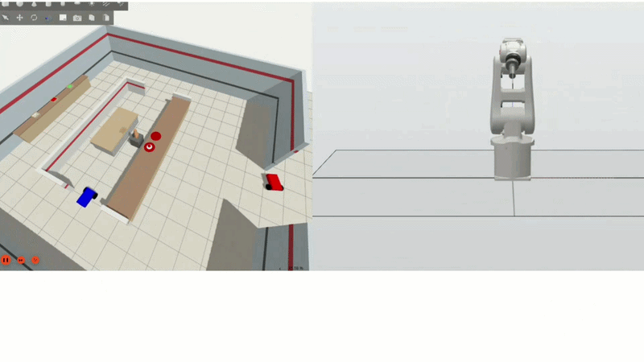
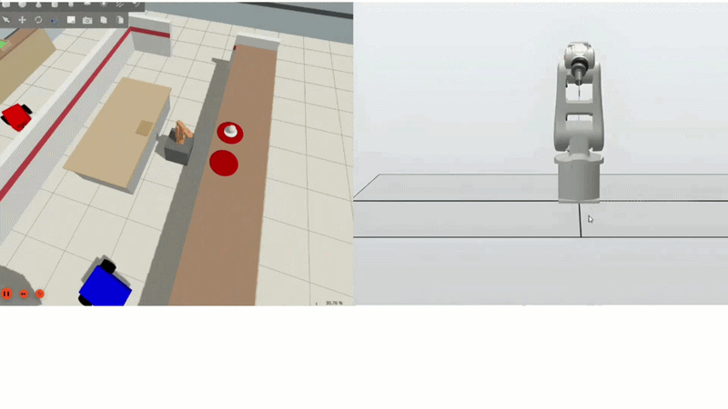
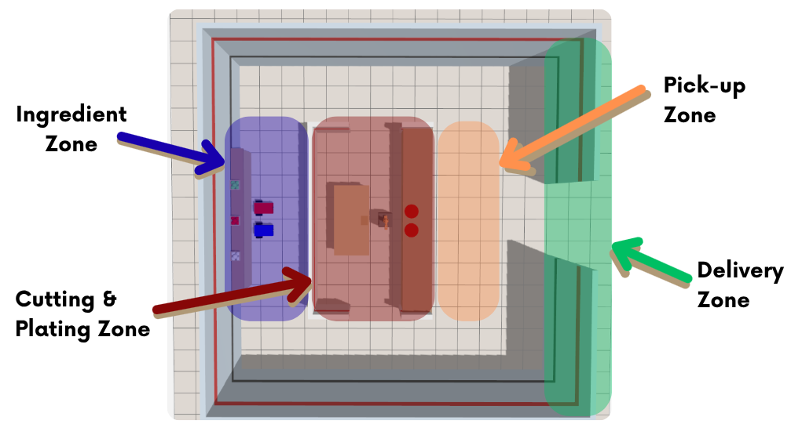

# Multi-Robot Coordination System for Industrial Logistics Inspired in Overcooked Videogame

<p align="center">
  
</p>

---

## 📊 Project Overview

[](#)
[](https://docs.ros.org/)
[](#)
[](https://navigation.ros.org/)
[](https://new.abb.com/products/robotics/industrial-robots/irb-120)

**Robotic Overcooked** is an advanced multi-robot coordination and task-allocation system inspired by the mechanics of the popular cooperative video game *Overcooked*, this project transitions those scheduling abstractions into a rigorous, simulated industrial kitchen-logistics cell. The application demonstrates how mobile manipulation agents, decentralized fleet managers, and static assembly arms can safely share a confined map layout, minimize navigation interference, and dynamic load-balance ongoing raw ingredient orders.

---

## 🎬 Visual Demonstration
<details>
<summary>📦 <b>Click here to expand the visual demonstration</b></summary>

  Initial starting sequence:


  ABB cutting action: 


  ABB plating action: 


  Ingredient withdrawal and finished plate delivery: 


  Finished plate delivery 2: 


</details>

## 🛠️ Technical Specifications & Prerequisites

### 💻 Software Stack
* **Operating System**: Ubuntu 22.04 LTS
* **Python** `v3.10.0`
* **Middleware**: **ROS 2 (Jazzy)**:
  * catkin_pkg
  * ros-jazzy-navigation2
  * ros-jazzy-nav2-bringup
  * ros-jazzy-slam-toolbox
  * ros-jazzy-robot-localization
  * ros-jazzy-ros2-control
  * ros-jazzy-ros2-controllers
* **Simulation Environments**: 
  * **Gazebo Harmonic**: Hosts the physics engine and mobile TurtleBot units.
  * **ABB RobotStudio**: Manages the native RAPID motion sequences and target joints for the stationary robot arm station.
* **Navigation Stack**: **Nav2** featuring Adaptive Monte Carlo Localization (**AMCL**) for laser-scan localization corrections.

---

## 📁 Code Architecture & Components

The workspace maps a physical loop layout separating cooking nodes, loading stations, and dual navigation lanes.

The coordination lifecycle executes across three distributed processing structures:

1. **Central Coordination Core**: Evaluates incoming order tickets, cross-checks active robot state-machines, and issues path targets via Action servers.
2. **Mobile Fleet Core**: Manages TurtleBot platforms. Incorporates tailored footprint layouts and optimized local planners to correct laser drift anomalies while maintaining localized grid positions.
3. **Manipulation Core**: Commands the ABB IRB 120 arm, polling continuous socket signals to perform pick-and-place trajectories handling the assembly/cooking cycle.


<details>
<summary>📦 <b>Click here to expand the detailed ROS 2 & Gazebo file structure</b></summary>

## 📌 Environment Overview and Sectors

The 3D simulated environment in **Gazebo** recreates a functional kitchen layout split into **four distinct operational zones** designed to optimize workflow and prevent spatial deadlocks:

<p align="center">
  
</p>

| Operational Area | Involved Agents | Description |
| :--- | :--- | :--- |
| **Ingredient Zone** | Mobile Robots | Storage and pantry area. This is the initial spawn point where mobile robots load raw ingredients. |
| **Cutting & Plating Zone** | ABB IRB 120 Arm | Exclusive workspace assigned to the industrial manipulator where it executes complex kinematic tasks (cutting food using a knife tool and plating). |
| **Pick-up Zone** | Mobile Robots | Safe interface area. The arm places the finalized dish on the worktop, allowing mobile robots to safely collect it without entering the arm's physical workspace. |
| **Delivery Zone** | Mobile Robots | Final destination of the route. The mobile robots drop off the completed order, closing the command lifecycle. |

---

## 🏗️ System Architecture

The ecosystem features a fully decoupled, hybrid architecture where **ROS2 acts as the Logical Brain**, interacting bi-directionally with **RobotStudio** and **Gazebo**.

graph LR
    %% Main Blocks/Subgraphs
    subgraph ROS2_Brain [Cerebro Lógico: ROS2]
        direction TB
        LG[LogicaGeneral2.py<br><b>Head Chef</b>]
        M2[mov2.py<br><b>Nav Bridge</b>]
        TF[tf_filter.py<br><b>Localization Fix</b>]
        
        LG -->|1. Assigns Order| M2
        TF -->|4. Feeds Pure Odometry| M2
    end

    subgraph Simulation [Entorno Físico: Gazebo]
        direction TB
        GZ[Kitchen World<br><b>Physics</b>]
        PP[PosePublisher<br><b>Ground Truth</b>]
        
        GZ -->|3. Extracts Real Position| PP
    end

    subgraph Industrial [Industrial Control: RobotStudio]
        direction TB
        RS[RAPID Server<br><b>TCP/IP Sockets</b>]
        IRB[ABB IRB 120<br><b>Arm Execution</b>]
        
        RS -->|Controls Mechanics| IRB
    end

    %% Simple Inter-connections
    M2 -->|2. Drives Mobile Robots| GZ
    PP -->|5. Corrects Drift| TF
    LG <-->|6. Sends Commands / Gets Telemetry| RS
    RS -.->|7. Syncs Visual Joints| GZ

    %% Visual Styling
    style ROS2_Brain fill:#e1f5fe,stroke:#03a9f4,stroke-width:2px
    style Simulation fill:#fff3e0,stroke:#ff9800,stroke-width:2px
    style Industrial fill:#ffebee,stroke:#f44336,stroke-width:2px
---

## 🧠 The "Head Chef" (State Machine)

The core module (LogicaGeneral2.py) governs the entire system via a highly scalable, cyclic state machine:

1. **Stochastic Order Monitoring**: Evaluates system robustness under dynamic loads. If fewer than 2 orders are active, it auto-generates new commands with an 80% probability.
2. **Synchronization & Telemetry**: Processes real-time joint positions from the ABB arm and destination arrivals from the mobile robots, dynamically holding or releasing agents.
3. **Scheduler & Task Allocation**: Pairs pending tasks with available agents based on capabilities, applying a mutual exclusion locking mechanism to prevent station duplication or collisions.

---

## 🧭 Multi-Robot Navigation & Advanced Localization

* **Namespace Isolation**: Standard Nav2 configurations do not natively support multiple robots sharing baseline topics. This was resolved by dynamically injecting the robot's namespace into all URDF frame prefixes and cloning/modifying the master nav2.yaml file per instance on the fly using the launch script.

* **Overcoming Laser Drift (Ground Truth)**: To prevent physical wheel slippage and inertia in Gazebo from throwing off the default AMCL filter (which caused sudden localization jumps), AMCL was disabled. Instead, a custom localization workflow (correccionPos.py and tf_filter.py) intercepts the TF tree, reads the exact absolute coordinate from Gazebo's PosePublisher plugin, and continuously updates the odom to base_footprint_link transform loop for drift-free navigation.

---

## 🦾 Industrial Arm Integration
The IRB 120 model was obtained from https://github.com/IFRA-Cranfield/ros2_SimRealRobotControl 

* **Real Industrial Control**: The ABB IRB 120 arm is driven by the official RobotStudio environment. It runs a custom RAPID script that sets up a TCP/IP Socket Server on port 5500. ROS2 connects directly to it as a client.

* **Synchronous Telemetry**: Utilizing a cyclic timer interrupt linked to a TRAP routine, RobotStudio streams joint positions (CJointT()) back to ROS2 every 0.2 seconds to keep the Gazebo/RViz visualizers (joint_state_broadcaster) perfectly synchronized.

* **Simulation Optimization**: To resolve severe drops in Gazebo's Real-Time Factor (which fell to 10%), the arm's URDF model was heavily optimized: all dynamic collision matrices for moving links were stripped out (as RobotStudio pre-validates paths safely), and geometric meshes were simplified in Blender. Link mass properties were also increased by a factor of 10 to prevent the arm from tipping over due to losing its static world reference.

---

## 📂 File System Structure

<table>
  <thead>
    <tr>
      <th>📂 Directory / File</th>
      <th>📝 Description</th>
    </tr>
  </thead>
  <tbody>
    <tr>
      <td><b>📁 proyecto/</b></td>
      <td>Main ROS2 package folder containing simulation files.</td>
    </tr>
    <tr>
      <td>&nbsp;&nbsp;&nbsp;&nbsp;└── 📁 config/</td>
      <td>YAML configuration files (dynamic configuration variants for Nav2).</td>
    </tr>
    <tr>
      <td>&nbsp;&nbsp;&nbsp;&nbsp;└── 📁 launch/</td>
      <td>Launch pipeline scripts.</td>
    </tr>
    <tr>
      <td>&nbsp;&nbsp;&nbsp;&nbsp;&nbsp;&nbsp;&nbsp;&nbsp;&nbsp;&nbsp;&nbsp;&nbsp;├── 📄 LogicaGeneral2.py</td>
      <td>"Head Chef" central module (State Machine controller).</td>
    </tr>
    <tr>
      <td>&nbsp;&nbsp;&nbsp;&nbsp;&nbsp;&nbsp;&nbsp;&nbsp;&nbsp;&nbsp;&nbsp;&nbsp;├── 📄 mov2.py</td>
      <td>Navigation interface and target destination bridge.</td>
    </tr>
    <tr>
      <td>&nbsp;&nbsp;&nbsp;&nbsp;&nbsp;&nbsp;&nbsp;&nbsp;&nbsp;&nbsp;&nbsp;&nbsp;└── 📄 simulation.launch.py</td>
      <td>Master launch file for spawning robots, Gazebo, and Nav2.</td>
    </tr>
    <tr>
      <td>&nbsp;&nbsp;&nbsp;&nbsp;└── 📁 src/</td>
      <td>Custom localization nodes (<code>correccionPos.py</code>, <code>tf_filter.py</code>).</td>
    </tr>
    <tr>
      <td>&nbsp;&nbsp;&nbsp;&nbsp;└── 📁 urdf/</td>
      <td>Optimized XACRO/URDF mesh definitions for robots and ABB arm.</td>
    </tr>
    <tr>
      <td>&nbsp;&nbsp;&nbsp;&nbsp;└── 📁 worlds/</td>
      <td>Gazebo Harmonic environment file containing the kitchen layout.</td>
    </tr>
    <tr>
      <td>&nbsp;&nbsp;&nbsp;&nbsp;├── ⚙️ CMakeLists.txt</td>
      <td>Package build configuration script.</td>
    </tr>
    <tr>
      <td>&nbsp;&nbsp;&nbsp;&nbsp;└── 📦 package.xml</td>
      <td>ROS2 manifest detailing project package dependencies.</td>
    </tr>
    <tr>
      <td><b>📁 rapid/</b></td>
      <td>RobotStudio workspace script directory (RAPID language).</td>
    </tr>
    <tr>
      <td><b>📄 README.md</b></td>
      <td>Project reference documentation.</td>
    </tr>
  </tbody>
</table>

</details>

---

## 🚀 Execution & Launch Sequence

1. Ensure the ROS 2 workspace is compiled and correctly sourced:
```bash
  mkdir -p /overcooked/src
  source /opt/ros/jazzy/setup.bash
  colcon build
  source install/setup.bash
  colcon build --symlink-install
```
2. Ensure that both the "Head Chef" logic script and the RobotStudio controller point to the exact IP address of the Windows machine running RobotStudio.
3. Open a terminal at the root of the compiled workspace and execute the main launch file:
```bash
  ros2 launch proyecto simulation.launch.py
```
4. Open the workspace station within RobotStudio, sync the code to the virtual controller, and press Play (Execute). The RAPID program will bind the socket and enter a passive listening state, waiting for the ROS2 client connection.
5. Open a new terminal, navigate to the launch script directory, and start the node:
```bash
  cd ~/overcooked/src/proyecto/launch/
  python3 LogicaGeneral2.py
```

This system has been developed as a project in collaboration with Alejandro Sosa Viña and Miriam García de la Reina Padilla.
